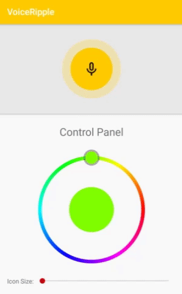
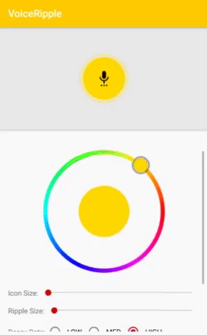

# VoiceRipple
 

# About
[]()

Voice Record Button that has ripple effect with users voice. Calculation of decibels from max amplitude by using the following:

```
power_db = 20 * log10(amp / amp_ref)
```

The aproximated decibel power of the sound is used to animate the button's ripple effect.

# Demo
[]() []()


# Implement
```gradle
dependencies {
  compile 'info.kimjihyok:voice-ripple-record-button:0.0.1'
}
```

## XML Setup
```XML
<info.kimjihyok.ripplelibrary.VoiceRippleView
    android:id="@+id/voice_ripple_view"
    android:layout_width="200dp"
    android:layout_height="200dp"
    app:rippleColor="@color/colorPrimary"/>
```

## Setter for view and android recorder related setup
```java
voiceRipple = (VoiceRippleView) findViewById(R.id.voice_ripple_view);

// set view related settings for ripple view
voiceRipple.setRippleColor(ContextCompat.getColor(this, R.color.colorPrimary));
voiceRipple.setRippleSampleRate(Rate.LOW);
voiceRipple.setRippleDecayRate(Rate.HIGH);
voiceRipple.setBackgroundRippleRatio(1.4);

// set recorder related settings for ripple view
voiceRipple.setMediaRecorder(new MediaRecorder());
voiceRipple.setOutputFile(audioFile.getAbsolutePath());
voiceRipple.setAudioSource(MediaRecorder.AudioSource.MIC);
voiceRipple.setOutputFormat(MediaRecorder.OutputFormat.THREE_GPP);
voiceRipple.setAudioEncoder(MediaRecorder.AudioEncoder.AMR_NB);
```

## Setter for recording status related setup
```java
// set inner icon for record and recording
voiceRipple.setRecordDrawable(ContextCompat.getDrawable(this, R.drawable.record), ContextCompat.getDrawable(this, R.drawable.recording));
voiceRipple.setIconSize(30);

// change recording status when clicked
voiceRipple.setOnClickListener(new View.OnClickListener() {
  @Override
  public void onClick(View view) {
   if (voiceRipple.isRecording()) {
      voiceRipple.stopRecording();
    } else {
      try {
        voiceRipple.startRecording();
      } catch (IOException e) {
        Log.e(TAG, "startRecording() error: ", e);
      }
    }
  }
});
```

## Stop and Destory
```java
// It is required to stop VoiceRippleView at onStop and to destory at onDestory to prevent memory leak and unexpected
@Override
protected void onStop() {
  super.onStop();
  voiceRipple.onStop();
}
 
@Override
protected void onDestroy() {
  super.onDestroy();
  voiceRipple.onDestroy();
}
```
